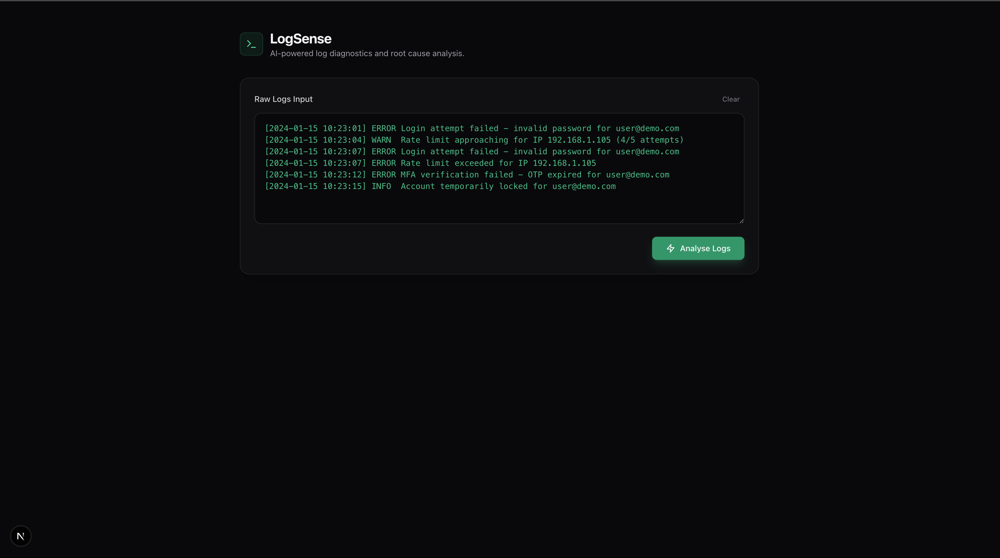
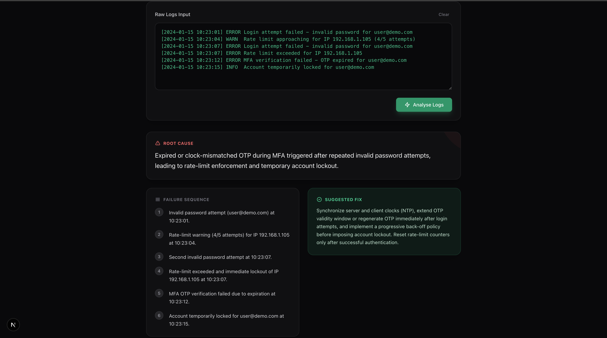

# LogSense

A minimalist Next.js tool that uses AI to ingest raw system logs and output structured, readable diagnostics.

## Features

- **Painless Analysis**: Paste any ugly, unformatted application or server logs directly into the tool.
- **AI-Powered Parsing**: Uses an LLM to automatically deduce the context, identify the core problem, and generate actionable insights.
- **Structured Output**: Renders a clean interface featuring the Root Cause, a step-by-step Failure Sequence, and a distinct Suggested Fix.
- **Modern UI**: Built with Tailwind CSS in a dark-themed, sleek stacked layout.

## Screenshots

| Initial State | Filled State |
| :---: | :---: |
|  |  |

## Getting Started

1. Navigate to the directory:
   ```bash
   cd logsense
   ```

2. Install dependencies:
   ```bash
   npm install
   ```

3. Run the development server:
   ```bash
   npm run dev
   ```

4. Open [http://localhost:3000](http://localhost:3000) to view the tool. The textarea will already be prefilled with a sample server log to test instantly.

## Architecture & Configuration

This project operates entirely on the Edge / Serverless environment using the Next.js App Router API. 

It defaults to using the free `pollinations.ai` endpoint. If you want to configure your own OpenAI or Anthropic API key, simply modify `app/api/analyse/route.ts` and set your key in `.env.local`.
